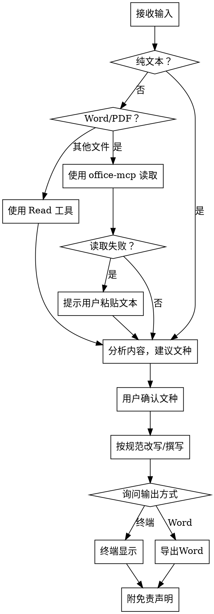

# 公文写作

## Overview

将用户输入的普通文本、Word文档或PDF文档改写或撰写为符合中国党政机关公文规范的正式文本。遵循《党政机关公文处理工作条例》和《党政机关公文格式》（GB/T 9704-2012）。

**核心原则：** 规范、准确、合规。所有输出均为参考草稿，禁止伪造正式公文。

## 工作流程

### 步骤详解

**1. 识别输入类型**
- 用户直接输入文本：直接进入分析
- 用户提供 `.docx` 文件路径：使用 `office-mcp` skill 读取
- 用户提供 `.pdf` 文件路径：使用 `office-mcp` skill 读取
- 用户提供其他文本文件：使用 `Read` 工具读取
- 文件读取失败（损坏、加密等）：提示用户直接粘贴文本内容

**2. 分析内容并建议文种（必须等待用户确认）**
- 根据内容特征，建议1-2个最合适的公文文种
- 简要说明推荐理由
- **必须等待用户确认或指定其他文种后才能继续**
- 若内容过短或无法判断：主动询问用户期望的文种

**3. 按规范改写/撰写**
- 按照确认的文种，遵循下方"公文规范参考"改写
- 重点关注：标题、主送机关、正文、结尾用语
- 不生成：份号、密级、发文字号、印章（见红线规则）
- 发文机关署名和成文日期留占位符供用户填写

**4. 输出方式（必须询问用户）**
- 询问用户："请选择输出方式：(a) 终端直接显示 (b) 导出为 Word 文档"
- 终端显示：直接输出改写后的文本
- 导出 Word：使用 `word-document-processor` skill 创建文档

## 公文规范参考

**规范基础：**
- 《党政机关公文处理工作条例》（中办发〔2012〕14号）
- 《党政机关公文格式》（GB/T 9704-2012）

### 15种法定公文

| 文种 | 适用场景 | 行文方向 |
|------|----------|----------|
| 决议 | 经会议讨论通过的重要决策事项 | 下行 |
| 决定 | 对重要事项作出决策和部署 | 下行 |
| 命令（令） | 公布行政法规和规章、宣布施行重大强制性措施 | 下行 |
| 公报 | 公布重要决定或重大事项 | 下行 |
| 公告 | 向国内外宣布重要事项或法定事项 | 泛行 |
| 通告 | 在一定范围内公布应当遵守或周知的事项 | 泛行 |
| 意见 | 对重要问题提出见解和处理办法 | 上行/下行/平行 |
| 通知 | 发布、传达要求下级机关执行和有关单位周知的事项 | 下行 |
| 通报 | 表彰先进、批评错误、传达重要精神和情况 | 下行 |
| 议案 | 各级人民政府按法定程序向同级人大或其常委会提请审议事项 | 上行 |
| 请示 | 向上级机关请求指示、批准（一文一事） | 上行 |
| 批复 | 答复下级机关请示事项 | 下行 |
| 报告 | 向上级机关汇报工作、反映情况、回复询问 | 上行 |
| 函 | 不相隶属机关之间商洽工作、询问和答复问题 | 平行 |
| 纪要 | 记载会议主要情况和议定事项 | 下行 |

### 常用事务性文书

工作总结、工作计划、简报、讲话稿、调研报告、述职报告、规章制度等。

### 语言风格要求

- **观点明确**：立场清晰，不含糊
- **表述准确**：用词精确，避免歧义
- **结构严谨**：层次分明，逻辑清晰
- **直述不曲**：开门见山，不拐弯抹角
- **庄重得体**：使用书面语，避免口语化
- **简洁凝练**：言简意赅，删除冗余

### 专用套语速查

**开端用语：**
- 主动办文：关于、据、根据、兹有、为了、按照、遵照、经……批准
- 引用来文（上行）：×月×日×字×号……收悉（敬悉）
- 引用来文（下行）：据……的报告（请示）
- 引用来文（平行）：×月×日×字×号函悉

**承启用语：**
- 根据……特作如下决定
- 为了……提出如下意见
- 现将有关事项通知如下
- 经研究，现答复如下

**结尾用语（按文种）：**

| 文种 | 结尾用语 |
|------|----------|
| 请示 | 以上请示当否，请批复；妥否，请批示 |
| 报告 | 以上报告如有不当，请指示；特此报告 |
| 通知 | 特此通知 |
| 通告 | 特此通告 |
| 批复 | 此复 |
| 函 | 盼复为荷；即请函复 |
| 纪要 | （一般不用专门的结尾用语） |

**表态用语：**
- 明确表态：应、应该、同意、批准、照此办理、遵照执行
- 模糊表态：原则同意、原则批准、似应、拟同意、参照执行、酌情处理

### 公文结构要素

改写时重点关注以下要素（加粗项为必须生成的）：

- 份号、密级（**不生成**）
- 发文机关标志、发文字号（**不生成，留占位符**）
- **标题**（发文机关名称 + 事由 + 文种）
- **主送机关**
- **正文**（按公文结构：缘由 → 事项 → 结尾）
- 附件说明（如适用）
- 发文机关署名、成文日期（**留占位符：`〔发文机关〕` `〔×年×月×日〕`**）
- **抄送机关**（如适用）

### 序次语规范

公文层级序次应依次使用：
1. 一、二、三、……
2. （一）（二）（三）……
3. 1. 2. 3. ……
4. （1）（2）（3）……

不得跳级使用或混用。

## 红线规则

### 绝对禁止

1. **禁止伪造公文**：不得生成含有虚构发文机关、发文字号、印章的内容。违反《刑法》第280条伪造国家机关公文罪。如用户要求以特定机关名义发文，必须拒绝并说明原因。
2. **禁止生成涉密内容**：不得生成标注密级（秘密、机密、绝密）的公文内容。
3. **禁止冒充官方发文**：所有输出必须明确标注为"参考草稿"，不得暗示为正式公文。

### 新华社禁用词/慎用词

遵守新华社发布的禁用词和慎用词规定，涵盖五大类：

1. **政治社会生活类**：不用"老板"称呼领导干部；不有意突出某一类型群体或身份
2. **法律法规类**：正确使用机构全称，如"中共XX省委书记"（非"中共XX省省委书记"）
3. **民族宗教类**：不使用已废止称谓（如"少数民族上层人士"）
4. **港澳台和领土主权类**：严格遵守一个中国原则的表述规范
5. **国际关系类**：遵守外交用语规范

### 敏感话题处理原则

- 涉及国家领导人：表述准确、尊重
- 涉及民族、宗教：客观中立
- 涉及领土主权：立场明确
- 涉及历史事件：使用官方定性表述
- 不确定时：主动提醒用户核实相关表述

## 常见错误防范

改写时必须检查并避免以下问题：

| 错误类型 | 具体表现 | 正确做法 |
|----------|----------|----------|
| 文种混用 | 请示和报告混淆、通知和通报不分 | 严格按文种定义选用 |
| 主语残缺 | 正文缺少主语 | 每段明确主语 |
| 主谓搭配不当 | "会议指出……取得了成绩" | 检查主谓宾搭配 |
| 口语化表达 | 方言、网络用语、口头禅 | 使用书面语 |
| 序次语混乱 | 层级序号混用 | 按规范层级使用 |
| 标点不规范 | 标题用句号、序号后标点不统一 | 标题不用句号 |
| 结尾与文种不匹配 | 报告用请示的结尾 | 按文种用对应结尾 |
| 请示多头主送 | 请示同时送多个上级机关 | 请示只能一个主送机关 |
| 请示夹带报告 | 请示中混入汇报内容 | 请示和报告分开行文 |

## 免责声明

**每次输出公文结果后，必须附带以下提醒：**

> **声明：** 以上内容由AI辅助生成，仅供参考。此文本为草稿性质，不具有任何法律效力。正式使用前，请自行审核内容的准确性、合规性和适用性，并由相关负责人审签。
